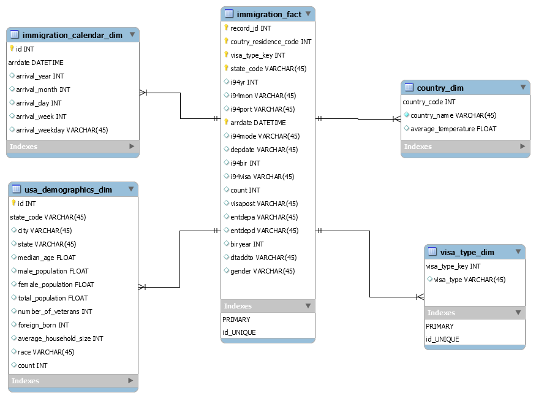

# Data Engineering Capstone Project
# Author - Ajay Jain

## Project Summary
The objective of this project was to create an ETL pipeline for I94 immigration, global land temperatures and US demographics datasets to form an analytics database on immigration events. A use case for this analytics database is to find immigration patterns to the US. For example, we could try to find answears to questions such as, do people from countries with warmer or cold climate immigrate to the US in large numbers?

## Data and Code
All data files was loaded into S3 before running etl.py script. 

project workspace:
* **etl.py** - reads data from S3, processes data using Spark, and writes processed data back to S3
* **etl_capstone_library.py and utils.py** - these modules contains the functions 
* **dl.cfg** - contains configuration that allows the ETL pipeline to access AWS EMR cluster. 
* **Jupyter Notebooks** - jupyter notebook that was used for building the ETL pipeline.
* **input_data and output_data** folders for raw data and processed data respectively

## Prerequisites
* AWS EMR cluster
* Apache Spark
* configparser

### The project follows the following steps:
* Step 1: Scope the Project and Gather Data
* Step 2: Explore and Assess the Data
* Step 3: Define the Data Model
* Step 4: Run ETL to Model the Data
* Step 5: Complete Project Write Up

## Step 1: Scope the Project and Gather Data
### Project Scope
To create the analytics database, the following steps will be carried out:
* Use Spark to load the data into dataframes.
* Exploratory data analysis on datasest to identify missing values and data cleaning.
* Create dimension tables.
* Create immigration calendar dimension table from I94 immigration dataset, this table links to the fact table through the arrdate field.
* Create country dimension table from the I94 immigration and the global temperatures dataset. The global land temperatures data was aggregated at country level. The table links to the fact table through the country of residence code allowing analysts to understand correlation between country of residence climate and immigration to US states.
* Create usa demographics dimension table from the us cities demographics data. This table links to the fact table through the state code field.
* Create fact table from the clean I94 immigration dataset and the visa_type dimension.

## Step 2: Explore and Assess the Data
> Refer to the jupyter notebook CapstoneProject.ipynb, for exploratory data analysis

## Step 3: Define the Data Model
### 3.1 Conceptual Data Model

### 3.2 Mapping Out Data Pipelines

* Load the datasets
* Clean the I94 Immigration data to create Spark dataframe for each month
* Create visa_type dimension table
* Create calendar dimension table
* Extract clean global temperatures data
* Create country dimension table
* Create immigration fact table
* Load demographics data
* Clean demographics data
* Create demographic dimension table

## Step 4: Run Pipelines to Model the Data 
### 4.1 Create the data model
> Refere to the jupyter notebook for the data dictionary.

### 4.2 Running the ETL pipeline
The ETL pipeline is defined in the etl.py script to create a pipeline that creates final tables in Amazon S3.
>  spark-submit etl.py    ( You may need to install libraries by pip install example sas7bdat by pip install sas7bdat )
OR
> spark-submit --packages saurfang:spark-sas7bdat:2.0.0-s_2.10 etl.py 

### Additional Details:
Please refer to CapstoneProjectAdditionalDetails.pdf placed here
